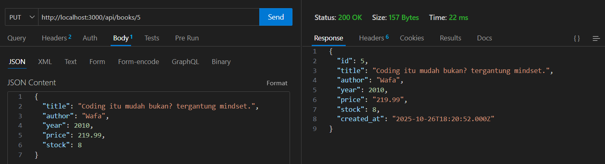

# Mini Project UTS – Books API (Express.js + MySQL)

REST API CRUD sederhana untuk resource `Books` menggunakan Express.js dan MySQL dengan struktur MVC dan middleware.

## Fitur

- CRUD endpoint:
  - GET /api/books
  - GET /api/books/:id
  - POST /api/books
  - PUT /api/books/:id
  - DELETE /api/books/:id
- Struktur folder MVC (config, models, controllers, routes, middleware)
- Middleware: logger, validate, error handler
- Konfigurasi via `.env`
- SQL init script untuk membuat database dan tabel
- Postman collection tersedia di folder `postman/`

## Skema Tabel

Tabel: `books`

- id (INT, PK, AI)
- title (VARCHAR)
- author (VARCHAR)
- year (INT)
- price (DECIMAL)
- stock (INT)
- created_at (TIMESTAMP, otomatis) ← memenuhi kolom tanggal yang diwajibkan

> Catatan: Kolom `created_at` ditambahkan untuk memenuhi ketentuan wajib ada kolom tanggal.

## Persiapan

1. Pastikan Node.js dan MySQL sudah terpasang.
2. Buat file `.env` berdasarkan `.env.example`.

```
PORT=3000
DB_HOST=localhost
DB_PORT=3306
DB_USER=root
DB_PASSWORD=your_password
DB_NAME=miniproject_db
```

3. Buat database dan tabel (opsi A atau B):
   - Opsi A: Jalankan script SQL:
     - File: `sql/init.sql`
   - Opsi B: Biarkan server membuat tabel otomatis saat start (database harus sudah ada dan sesuai `DB_NAME`).

## Menjalankan Proyek

1. Instal dependencies
2. Jalankan server (development dengan nodemon atau production biasa)

### Endpoint Contoh (Body JSON)

POST /api/books

```
{
  "title": "Clean Code",
  "author": "Robert C. Martin",
  "year": 2008,
  "price": 199.99,
  "stock": 10
}
```

PUT /api/books/:id

```
{
  "title": "Clean Code (2nd)",
  "author": "Robert C. Martin",
  "year": 2010,
  "price": 219.99,
  "stock": 8
}
```

## Pengujian dengan Thunder Client (Screenshots)

Di bawah ini adalah hasil uji endpoint menggunakan Thunder Client (ekstensi bawaan VS Code). Setiap gambar menunjukkan request dan response yang sesuai dengan endpoint.

1. GET semua buku — `GET /api/books`


2. GET buku berdasarkan ID — `GET /api/books/:id`


3. Tambah buku — `POST /api/books`


4. Perbarui buku berdasarkan ID — `PUT /api/books/:id`



5. Hapus buku berdasarkan ID — `DELETE /api/books/:id`


6. Verifikasi hasil penghapusan


